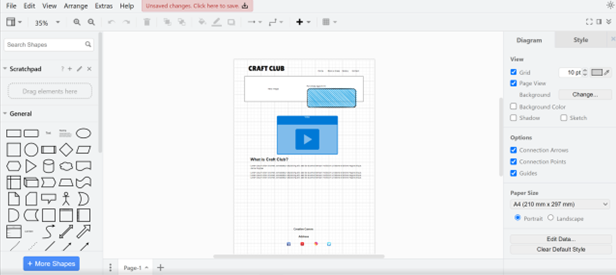
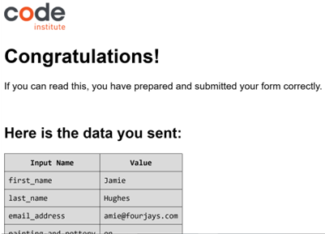
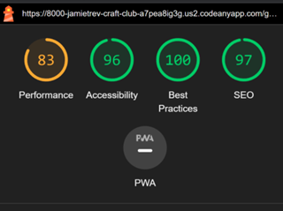

# PORTFOLIO PROJECT - 1

# Craft Club

## Purpose

The Craft Club website is a landing page for parents and children looking for a fun and creative arts and crafts club for ages 4 to 14.
Craft Club offers fun activities and caters to those wishing to explore their creative side.

Users of this website will be able to find the information they need to know about our Craft Club such as available art class times, location, contact information and how to book. This site is targeted towards parents of children who want show their art skills.

* [Here is a link to the final project](https://jamietrev.github.io/craft-club/)

## Final Design

## INITIAL CONCEPT

My initial idea for the project was to create a colourful art website for parents to easily book their children onto art classes or book birthday parties.

* The Features I wanted the project to have are:

    * To make the site easy to read
    * Have a bright colour scheme (yellow red, purple)
    * Have an easy to navigate "Nav Bar" 
    * Look fun with images, and easy to book classes

#  
#  
## CONTENTS

- [UX/UI](#uxui)
- [WIREFRAMES](#wireframes)
  * [FEATURES](#features)
  * [DESIGN](#design)
- [TESTING](#testing)
  * [DEVICES](#devices)
  * [VALIDATORS](#validators)
  * [LIGHTHOUSE](#lighthouse)
- [SOLVED BUGS](#solved-bugs)
  * [UNSOLVED BUGS](#unsolved-bugs)
- [DEPLOYMENT](#deployment)
- [CREDITS](#credits)
- [ACKNOWLEDGEMENTS](#acknowledgements)

#  
#
# UX/UI
* This website was created to show my knowledge of HTML and CSS and to provide a fun service to parents and children
* The site should be simple to navigate and easy for parents to book art classes
* The site should be easy to read, images should be clear without dimensions being compromised

## WIREFRAMES

* My first draft of wireframes was drawn freehand, I did start to draw up these wireframes using https://app.diagrams.net/ but just like a lot of my artwork, I was unsure what exactly I wanted my site to look like so I left it vague
* 

## FEATURES

* The site consists of: 
    * 3 main pages, `HOME, GALLERY, MAKE BOOKING`
    * Each page will have the same body layout, `HEADER (TITLE)`, `NAVBAR`, `MAIN CONTENT` and `FOOTER (ADDRESS AND SOCIAL MEDIA ICONS/LINKS)`
* Navigation bar:
* 
* Welcome message:
* 
* Shortcut link to class timetable:
* 
* Club Ethos:
* 
* Class Timetable:
* 
* Footer:
* 
* Layout and content:
    * The Home page will have a welcome message indicating who the taget audience is, overlaying 1 large picture as an example of what the Craft Club has to offer. A description of the classes and a timetable of when the classes are
    * The Gallery will have multiple images of art children have produced and what there is to offer at the art classes
    * The Book Now page will have a form to include first name, last name, email address, a check box option to choose a class and which age class the user would like to book, an additional comments box and a send button

* Contact Form:
    * Form validation requests the user to input the correct information in the input fields,
      This avoids the user sending illegible text/email.
    * 

## DESIGN
* Color Scheme:
    * This was always going to be a bright colour due to the fact this is an arts a crafts website, the colour scheme chosen were yellow, red and purple, all the while ensuring all text was clear and readable
    * 

* IMAGES
    * I sourced most of the images for the gallery and have downloaded 7 stock images from https://www.pexels.com/
    * There are a total of 16 images across the site, including one for the background image
    * All images have been compressed through `Tinypng.com`

* TYPOGRAPHY
    * The fonts used for my website are "Nunito" and "Dosis". The font is imported from Google Fonts

# 

# TESTING

* The site has been tested through multiple tests on each individual page.
* I have tested that all the footer links direct to the correct page opens in a new tab.
* I have checked all the nav links direct to the correct page.
* I have checked the form to ensure mandatory data is filled in correctly and works correctly
* 

# DEVICES
* I have tested responsiveness and functionality on android, apple devices, desktops and laptops and on different browsers, more specifically:
    * Galaxy Note II
    * Iphone SE
    * Iphone XR
    * Iphone 12 Pro
    * Pixel 5
    * Samsung Galaxy s8+
    * Samsung Galaxy S20 Ultra
    * Ipad Air
    * Ipad Mini
    * Surface Pro 7
    * Surface Duo
    * Nest Hub
    * Nest Hub Max
    * Lenovo Thinkpad
    * Mac Book Pro
    * Browsers:
      * Chrome
      * Edge
      * Firefox
      * Safari
      * Samsung internet

## Validators

* I ran all of my code through css-validator and html-validator

## Lighthouse

* I ran each page live through Chrome Lighthouse and received the following results:
* 

# Bugs and Fixes

## SOLVED BUGS

* When I checked my code in the browser, none of the styling was being applied until I realised I had not used the correct file path to the stylesheet.
* Images were not uploading: I would drag the images I wanted to the images folder but the upload status remained at 0 for many minutes until I realised the file size I was trying to upload were too big.
I reduced the size using <https://tinypng.com/>
* Lots of trial and error was necessary to resolve the responsiveness of different screen sizes.

## UNSOLVED BUGS

* I have had continuous issues with my README file in which certain keys of my computer keyboard will not respond. The backspace and enter keys are not working and like the template I was using at the beginning of this project, I now do not have short hand use of syntax which takes significantly longer.

# DEPLOYMENT

* The website was deployed using GitHub Pages by following these steps:

1. In the GitHub respository navigate to the Settings tab.
2. Select Pages from the menu on the left-hand side of the page.
3. For the source select Branch: 'main' and then select: 'save'.
4. After the webpage refreshes automatically a ribbon at the top will displays the following message: "Your site is live at https://github.com/JamieTrev/craft-club"

* The website repository can be forked by the following steps:

1. Go to the GitHub repository.
2. Click on the Fork button in the upper right hand corner.

* The repository can be cloned by the following steps:

1. Got to the GitHub repository.
2. Locade the Code button above the list of files and click on it.
3. Select if you prefer to clone using HTTPS, SSH, or Github CLI and click the copy button to copy the URL to your clipboard.
4. Open Git Bash.
5. Change the current working directory to the one where you want the cloned directory.
6. Type git clone and paste the URL from the clipboard ($ git clone https://github.com/YOUR-USERNAME/YOUR-REPOSITORY)
7. Press Enter to create your local clone.

# CREDITS

## Content

* The club ethos section and the gallery were loosly based on the love running project.

## References

* I reduced the image file size using <https://tinypng.com/>
* I downloaded 7 images from www.pexels.com
* I decided to choose a colour palette from colorhunt.co
* Used Lighthouse (performace score was 61 before resizing images on imageresizer.com and performance climbed to 83).
* I used https://fontawesome.com/ for the icons next to the headings

## ACKNOWLEDGEMENTS

* Many thanks to tutors, students and graduates in the Slack community for helpful advise along the way.
* Big thank you to my Tutor Sandeep Aggarwal for his time and advise on our calls.
* Thank you to my Mum for the inspiration for the Craft Club project idea.
* Thank you to my wife Chloe for her support in getting enrolled onto this course.